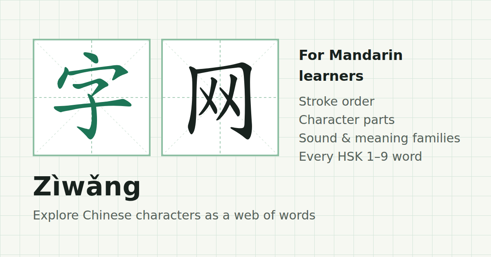

# Zìwǎng 字网

**A free website for exploring Chinese characters as a web of words.**

**[ziwang.app](https://ziwang.app)**



Pick any character and see how it is written, what it is made of, and every HSK word it appears in. From 电 (electricity) you can jump to 电视 (television), 电脑 (computer) and 电影 (film), then click through to 视, 脑 or 影 and keep going.

It is free, has no ads and needs no account.

---

## Why I made this

I'm learning Mandarin. The tools I liked best were the ones that let me look at a single character and see where else it turns up, and I wanted one that did exactly that, looked good, and was quick to wander around in.

I'm not a software developer. I built Zìwǎng with [Claude](https://claude.ai). If you spot something broken or a definition that looks wrong, please [open an issue](../../issues).

---

## What you can do

**Explore a character**
- Watch the stroke order animate on a practice grid (田字格)
- Practise writing it yourself by tracing each stroke, with hints if you get stuck
- Hear it read aloud, using your browser's built-in Mandarin voice
- See its pinyin, meaning, HSK level, radical and stroke count

**See how it's built**
- The parts it's made from, labelled as the *meaning* part or the *sound* part where that applies
- A short note on where the character comes from, e.g. 休 is a person 亻 leaning against a tree 木
- **Sound family:** characters that share its sound part (妈 吗 码 骂)
- **Meaning family:** characters that share its meaning part
- **Found inside:** characters that contain it

**Explore its words**
- A word web: the character in the middle, words around it, and the other characters in those words on the outside. Click any outer character to travel there.
- A full word list grouped by HSK level, with pinyin coloured by tone
- **Hide English**, which blurs the meanings so you can test yourself
- Filter everything by HSK level (1 to 7–9)

**Get around**
- Search by character, pinyin (`ma`, `ma3`) or English (`horse`)
- **Wander** jumps to a random HSK 1–3 character
- A trail of the characters you've visited
- Lists of every character by HSK level
- Five themes: 练习本 Exercise book, 黑板 Blackboard, 青花 Porcelain, 水墨 Ink wash and 灯笼 Lantern

---

## What's inside

| | |
|---|---|
| Words | 10,969 words from the new HSK 3.0 syllabus, levels 1 to 7–9 |
| Characters | 2,970 HSK characters, plus about 360 components such as 讠 and 氵 |
| Pages | One page per character, e.g. [ziwang.app/zi/电/](https://ziwang.app/zi/电/) |

### Data

| Source | Used for | Licence |
|---|---|---|
| [complete-hsk-vocabulary](https://github.com/drkameleon/complete-hsk-vocabulary) | HSK word lists, levels and pinyin | MIT |
| [CC-CEDICT](https://cc-cedict.org) (via the list above) | English definitions | CC BY-SA 4.0 |
| [Make Me a Hanzi](https://github.com/skishore/makemeahanzi) | Character parts, origins and stroke data | Arphic Public License / LGPL |
| [Hanzi Writer](https://hanziwriter.org) | Stroke animation and writing practice | MIT |

Fonts are Noto Serif SC, Schibsted Grotesk and Ma Shan Zheng from Google Fonts.

---

## How it works

The site is plain HTML, CSS and JavaScript.

| File | What it does |
|---|---|
| `build.js` | Generates the whole site into `_site/` |
| `core.js` | Dictionary lookups, search, and the HTML for each section |
| `app.js` | Everything interactive: word web, themes, stroke animation, audio |
| `style.css` | Layout and the five themes |
| `data.json` | Words and characters, prepared from the sources above |
| `config.js` | Analytics ID and support link |

### Run it yourself

You'll need [Node.js](https://nodejs.org).

```bash
npm install
node build.js
cd _site && python3 -m http.server 8000
```

Then open http://localhost:8000. The site expects to be served from the root of a domain, so it won't work from a subfolder.

---

## Privacy

There are no accounts. Your theme, trail and settings are saved in your own browser and never leave it. The site uses Google Analytics to count visits and see which features people use.

---

## Support

If Zìwǎng helps you learn, you can [buy me a coffee](https://buymeacoffee.com/ygQf1M8jAA).

---

## Licence

The code is licensed under the [GNU AGPL v3](LICENSE). You're free to use, change and share it. If you run a modified version publicly, please share your changes under the same licence.

The dictionary data keeps its original licences, listed under [Data](#data).
